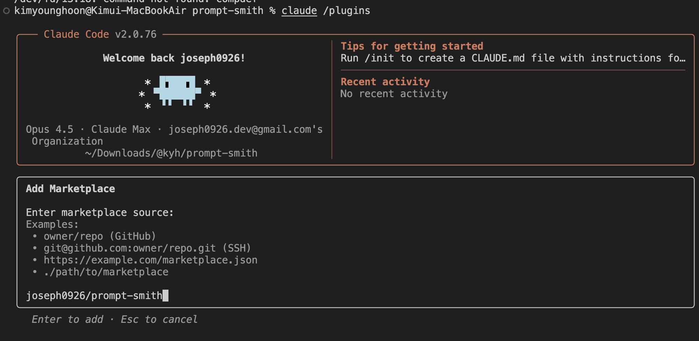

# PromptShield

> Claude Code를 위한 프롬프트 품질 관리 도구

[](https://opensource.org/licenses/MIT)
[](https://github.com/joseph0926/prompt-shield/releases)


**핵심 기능**:
- 8-Point Quality Check (LINT / BUILD / Review / Intercept)
- Eval Mode: 테스트 데이터셋 기반 A/B 테스트
- Long Context: 200K 토큰 최적화
- Token Management: 비용 예측 및 컨텍스트 검증
- Structured Outputs: 100% JSON 유효성 보장

## 언제 어떤 모드를 사용할까?

| 상황 | 권장 모드 | 커맨드 |
|------|----------|--------|
| "이 프롬프트 괜찮나?" | LINT | `/ps:lint <프롬프트>` |
| "프롬프트 개선해줘" | Review | `/ps:r <프롬프트>` |
| "그냥 고쳐서 실행해" | Intercept | `/ps:a <프롬프트>` |
| "새 프롬프트 설계해줘" | BUILD | `/ps:build <목표>` |
| "A/B 테스트 해보고 싶어" | Eval | [Eval Mode](skills/prompt-shield/playbooks/eval/eval-mode.md) 참고 |

## 빠른 시작

### 커맨드 요약

| 커맨드 | 설명 | 용도 |
|--------|------|------|
| `/ps:r <프롬프트>` | **Review Mode** - 개선안 표시, 승인 대기 | 일상 사용 (안전) |
| `/ps:lint <프롬프트>` | **LINT Mode** - 전체 진단 + 테스트 케이스 | 프롬프트 디버깅 |
| `/ps:a <프롬프트>` | **Intercept Mode** - 자동 개선 후 즉시 실행 | 빠른 작업 |
| `/ps:build <목표>` | **BUILD Mode** - 요구사항에서 설계 | 새 프롬프트 |
| `/ps:help [주제]` | **Help** - 사용 가이드 | 시작하기 |

**빠른 예시**:
```
/ps:r JSON 파싱 함수 만들어줘
```
점수 (3/10 → 8/10), 변경사항 표시 후 "진행? (y/n/e)" 질문

---

### 방법 1: 플러그인 설치 (슬래시 커맨드 활성화)

1. VS Code에서 `/plugin` 입력하여 플러그인 터미널 열기
2. `Tab` 키로 "Add Marketplace" 이동
3. `joseph0926/prompt-shield` 입력
4. `Tab` 키로 "Install Plugin" 이동
5. `ps@prompt-shield` 선택



### 방법 2: 로컬 플러그인 (개발용)

```bash
git clone https://github.com/joseph0926/prompt-shield
claude --plugin-dir ./prompt-shield
```

### 방법 3: 스킬만 설치 (자연어 트리거)

```bash
git clone https://github.com/joseph0926/prompt-shield
cp -r prompt-shield/skills/prompt-shield ~/.claude/skills/
```

> **참고**: 이 방법은 자연어 트리거(`prompt-shield 사용 -r`)만 활성화됩니다. 슬래시 커맨드는 사용 불가.

### 사용법

**슬래시 커맨드 (권장)**:

````
/ps:r 프롬프트                     # Review Mode (한 줄)
/ps:r 프롬프트
여러 줄로 작성 가능                # Review Mode (여러 줄)
/ps:a 프롬프트                     # Intercept Mode
/ps:lint 프롬프트                  # LINT Mode
/ps:build 요구사항                 # BUILD Mode
````

> **참고**: 트리플 백틱(```)은 선택사항입니다. 일반 텍스트와 여러 줄 입력을 완전히 지원합니다.

**자연어 (대안)**:

```
prompt-shield 사용 -r 프롬프트 내용
```

## 실제 예시

### LINT 모드 (진단)
```
/ps:lint 사용자 피드백 분석해줘
```
**출력**: 점수 3/10 → Top 3 이슈 → 개선된 프롬프트 → 테스트 케이스 5개

### Review 모드 (안전한 개선)
```
/ps:r JSON 파싱 함수 만들어줘
```
**출력**:
```
+----------------------------------------------------------+
| 점수: 3/10 -> 8/10 (+5)                                  |
+----------------------------------------------------------+
변경사항:
- [+] 추가: 소프트웨어 엔지니어 역할
- [+] 추가: 에러 핸들링 예시
- [~] 수정: 반환 형식 명시

진행? (y/n/e)
```

### Intercept 모드 (자동 수정)
```
/ps:a 이 문서 요약해줘
```
**출력**: +2점 이상 개선 가능하면 자동 적용 → 즉시 실행

## v3.x 신기능

### v3.3.1 (최신)

| 기능 | 설명 |
|------|------|
| **예시 & TOC** | Examples 확장 + 긴 참고 문서 TOC 추가 |
| **Structured Outputs** | 스키마 불일치 처리 가이드 강화 및 JSON 모드 주의사항 |

### v3.3.0

| 기능 | 설명 |
|------|------|
| **ps:a 토큰 효율화** | 최소 출력: `[PromptShield] 활성화됨 (X→Y점)` |
| **ps:r 의도 반영** | AskUserQuestion으로 형식/상세도/제약/성공기준 질문 |

### v3.2.0

| 기능 | 설명 |
|------|------|
| **Eval Mode** | 테스트 데이터셋 기반 A/B 비교 |
| **Long Context** | 200K 토큰 최적화 (청킹, 배치) |
| **Token Management** | 비용 예측, 컨텍스트 윈도우 검증 |
| **Structured Outputs** | 100% JSON 유효성 기법 |

### v3.0.0 - v3.1.0

| 기능 | 설명 |
|------|------|
| **Progressive Loading** | 온디맨드 스킬 로딩 |
| **Hooks** | 프롬프트 제출 시 자동 LINT (선택) |
| **Agents** | 3개 전문 에이전트 |
| **GitHub Actions** | CI/CD 통합 |

전체 릴리스 노트는 [CHANGELOG.md](CHANGELOG.md)를 참고하세요.

## 모드

| 모드      | 슬래시 커맨드          | 자연어                    | 설명                       |
| --------- | ---------------------- | ------------------------- | -------------------------- |
| Review    | `/ps:r <프롬프트>`     | `prompt-shield 사용 -r`    | 개선안 표시 후 승인 대기   |
| Intercept | `/ps:a <프롬프트>`     | `prompt-shield 사용 -a`    | 자동 개선 후 즉시 실행     |
| LINT      | `/ps:lint <프롬프트>`  | `이 프롬프트 점검해줘`    | 기존 프롬프트 진단         |
| BUILD     | `/ps:build <목표>`     | `~하는 프롬프트 만들어줘` | 요구사항에서 프롬프트 설계 |

## 8-Point Quality Check

| #   | 차원             | 점수  | 비고 |
| --- | ---------------- | ----- | ---- |
| 1   | ROLE             | 0-2   | 기본 |
| 2   | CONTEXT          | 0-2   | 기본 |
| 3   | INSTRUCTION      | 0-2   | 기본 |
| 4   | EXAMPLE          | 0-2   | 기본 |
| 5   | FORMAT           | 0-2   | 기본 |
| 6   | SUCCESS_CRITERIA | 0-2   | 기본 (v2.7+) |
| 7   | STATE_TRACKING   | 0-2   | 확장 |
| 8   | TOOL_USAGE       | 0-2   | 확장 |

**기본 점수**: 차원 1-6 (최대 12 → 10점으로 정규화)
**확장 점수**: 전체 8개 차원 (정규화)

## 문서

### 시작하기
- [빠른 시작](skills/prompt-shield/onboarding/quick-start.md)
- [첫 LINT](skills/prompt-shield/onboarding/first-lint.md)
- [첫 BUILD](skills/prompt-shield/onboarding/first-build.md)

### 모드 가이드
- [LINT Mode](skills/prompt-shield/playbooks/lint/full-lint.md)
- [BUILD Mode](skills/prompt-shield/playbooks/build/build-mode.md)
- [Review Mode](skills/prompt-shield/playbooks/intercept/review-mode.md)
- [Intercept Mode](skills/prompt-shield/playbooks/intercept/intercept-mode.md)
- [Eval Mode](skills/prompt-shield/playbooks/eval/eval-mode.md)

### 고급 (v3.2.0)
- [Long Context 최적화](skills/prompt-shield/references/long-context-optimization.md)
- [Token 관리](skills/prompt-shield/references/token-management.md)
- [Structured Outputs](skills/prompt-shield/references/structured-outputs.md)
- [Prompt Chaining](skills/prompt-shield/playbooks/prompt-chaining.md)

### 엔터프라이즈 / 팀 운영
- [엔터프라이즈 준비 체크리스트 (영문)](docs/enterprise-readiness.md)
- [프롬프트 오너 가이드](skills/prompt-shield/playbooks/team/owner-guide.md)
- [Prompt PR 규칙](skills/prompt-shield/playbooks/team/prompt-pr.md)
- [회귀 테스트](skills/prompt-shield/playbooks/team/regression-testing.md)

### 참고
- [8-Point Quality 체크리스트](skills/prompt-shield/references/quality-checklist.md)
- [안티패턴](skills/prompt-shield/references/anti-patterns.md)
- [기법 우선순위](skills/prompt-shield/references/technique-priority.md) (Anthropic 권장)
- [Claude 4.x 베스트 프랙티스](skills/prompt-shield/references/claude-4x-best-practices.md)

## 문제 해결

### 슬래시 커맨드가 작동하지 않음
1. 플러그인 확인: VS Code에서 `/plugin` → 설치 목록 확인
2. VS Code 재시작 또는 Claude Code 확장 새로고침
3. 플러그인 재설치 시도

### 점수가 이상함
- 확장 항목(STATE_TRACKING, TOOL_USAGE)은 멀티스텝/도구 사용 프롬프트에만 적용
- N/A인 경우 점수 계산에서 제외됨

## 플랫폼

- **Claude Code** (CLI / VS Code 확장)

## 기여

기여를 환영합니다! [CONTRIBUTING.md](CONTRIBUTING.md)를 참고하세요.

- [버그 리포트](https://github.com/joseph0926/prompt-shield/issues)
- [보안 이슈](SECURITY.md)

## 라이선스

MIT License - [LICENSE](LICENSE) 참고
